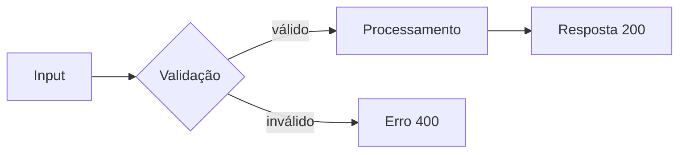
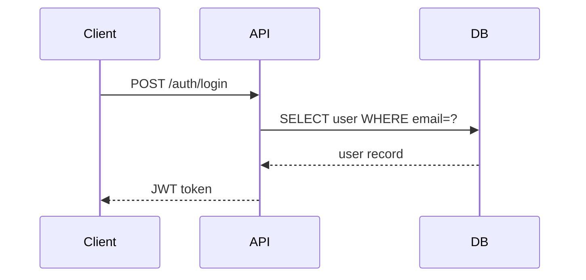
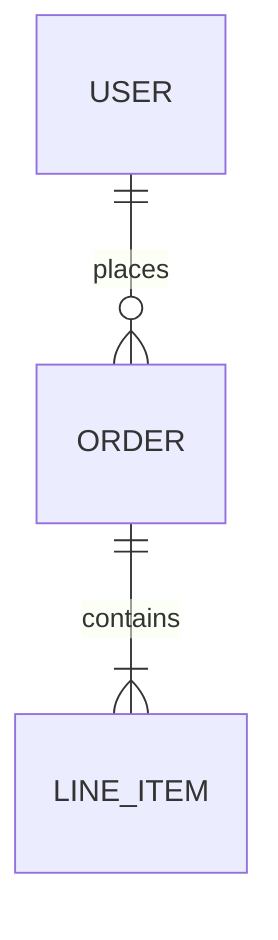
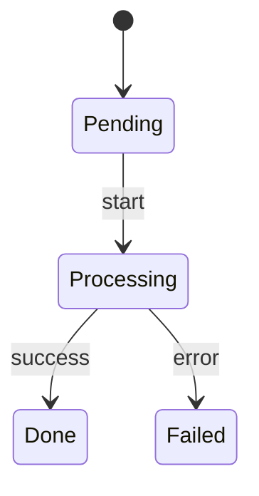

# Technical Writing para Software Complexo

## ADR — Architecture Decision Record

Toda decisão arquitetural relevante deve ser documentada em `docs/decisions/YYYY-MM-DD-{slug}.md`.

### Template ADR

```markdown
# ADR-{NNN}: {Título da Decisão}

**Data:** YYYY-MM-DD
**Status:** Proposto | Aceito | Depreciado | Substituído por ADR-{NNN}
**Contexto:** {O problema que precisa ser resolvido. Forças em jogo.}

## Decisão

{A decisão tomada, explicada de forma direta.}

## Consequências

**Positivas:**
- {benefício 1}

**Negativas:**
- {trade-off 1}

## Alternativas Consideradas

| Alternativa | Por que descartada |
|---|---|
| {opção A} | {motivo} |

## Diagrama (se aplicável)

\`\`\`mermaid
graph TD
    A[Cliente] --> B[API Gateway]
    B --> C[Auth Service]
    B --> D[Core Service]
\`\`\`
```

## Module Spec

Documentação de módulo em `docs/modules/{module-name}.md`.

### Template Module Spec

```markdown
# Módulo: {Nome}

**Responsabilidade:** {Uma frase descrevendo o que este módulo faz}
**Owner:** {Agente ou pessoa responsável}

## Interface pública

\`\`\`typescript
// Exports principais
export function {functionName}(params: {ParamsType}): {ReturnType}
\`\`\`

## Dependências

- **Requer:** {módulos que este consome}
- **Expõe para:** {módulos que consomem este}

## Fluxo de dados

\`\`\`mermaid
sequenceDiagram
    participant C as Client
    participant M as {Module}
    participant D as Database
    C->>M: request
    M->>D: query
    D-->>M: result
    M-->>C: response
\`\`\`

## Decisões relevantes

- [ADR-{NNN}]({link}) — {título}
```

## Smart Memory — Formato Obsidian

Documentos em `docs/smart-memory/` usam frontmatter com links relativos para navegação:

```markdown
---
title: {Título}
type: overview | story | decision | schema | research | task-log
agent: {nome-do-agente}
created: YYYY-MM-DD
updated: YYYY-MM-DD
tags: [tag1, tag2]
related: ["[[caminho/relativo]]"]
---
```

Links internos entre documentos: `[[caminho/relativo]]` — compatível com Obsidian.

## Diagramas Mermaid — Tipos Úteis

### Fluxo de dados (flowchart)


### Sequência de chamadas


### Entidades do banco


### Estado de um fluxo


## Regras de escrita técnica

- **Uma ideia por parágrafo** — leitor deve entender sem reler
- **Voz ativa** — "o sistema valida" não "a validação é feita"
- **Exemplos concretos** — código > descrição abstrata
- **Mermaid no repo** — nunca imagens externas, diagramas devem versionar junto com código
- **Links entre docs** — ADR referencia módulo, módulo referencia ADR
- **Data em tudo** — decisão sem data não tem contexto temporal
- **Frontmatter obrigatório** — todo documento na smart-memory deve ter frontmatter completo
